Devolutions RDM - Remote Desktop Manager Enterprise

Thursday, September 8, 2022

2:57 PM

 

\<\<DEVLOUTIONS\_RMD\_CUSTOM\_Package.rdi\>\>

 

**1st. Install the free Enterprise .msi to a VM or Sandbox**

 

**Installer File Generator**

**DESCRIPTION**

When creating an installation package with the ***Custom Installer Manager***, an installer file is necessary to determine what to include in the installation configuration. It is risky to create an installer file for each new version since you have to repeat the process manually every time. Instead, it is possible to create the configuration once, save the resulting file (\*.rdi), and reuse it as many times as needed.

**CREATING AN INSTALLER FILE**

1\. Click on ***File - Devolutions Account - Installer File Generator.***

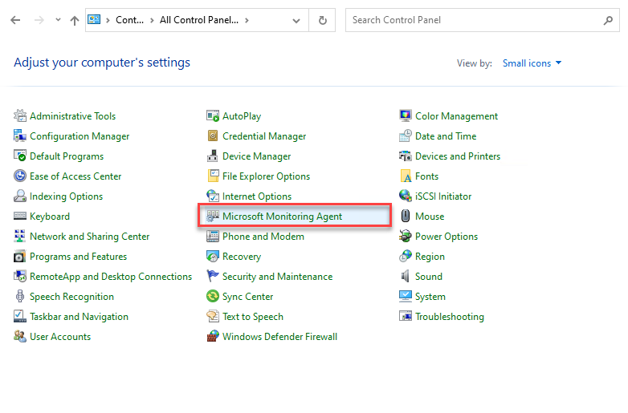

*File - Devolutions Account - Installer File Generator*

2\. Select which data sources to include. You can also include the name and serial key for the registration.

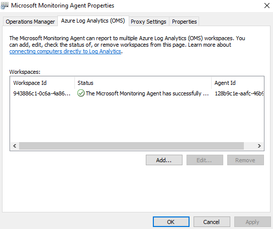

*Installer File Generator*

3\. Click ***Generate*** and save the file.

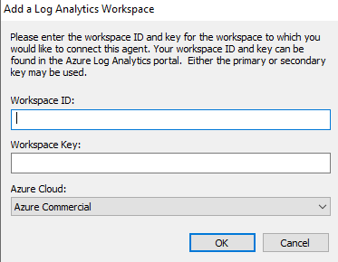

*Save the installer file*

An information dialog is displayed when the file has been generated.

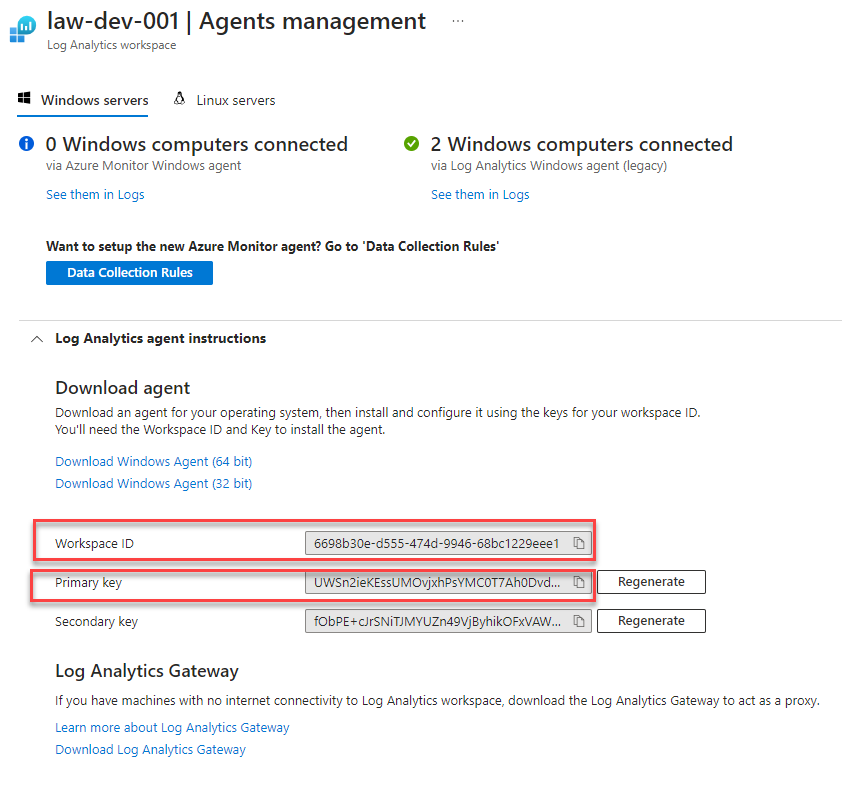

*Package.rdi has been generated successfully*

This file can be used in the ***Custom Installer Manager*** when creating an installation package.

For more information on how to create a custom installer package, please consult our [Custom Installer Manager](https://help.remotedesktopmanager.com/installation_custominstallermanager.html) topic.

 

*From \<<https://help.remotedesktopmanager.com/installation_installerfilegeneration.html>\>*

 

**CREATE AN INSTALLATION PACKAGE**

1.Click on ***File - Devolutions Account - Sign-in* **to connect to your ***Devolutions Account***.

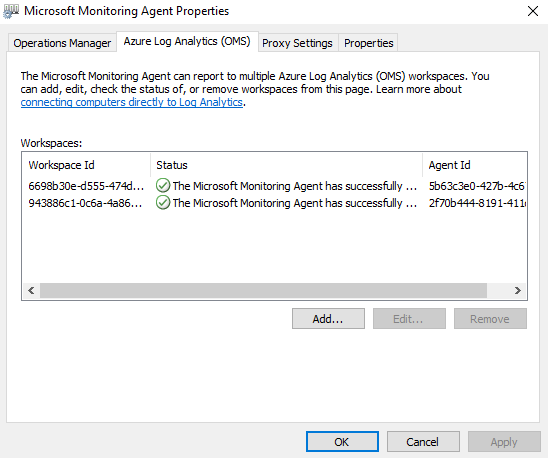

*Devolutions Account Sign-in*

2.Click on ***Custom Installer Manager*** to create a new custom installer with specific settings.

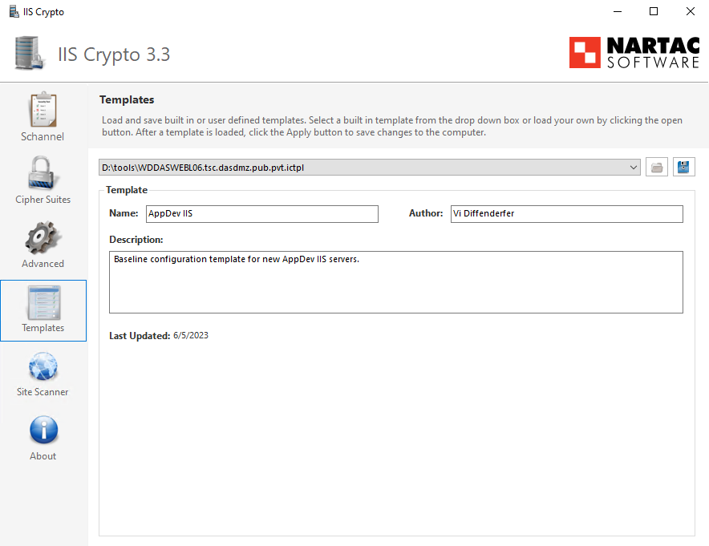

*File - Devolutions Account - Custom Installer Manager*

3.Click on ***New Package***.

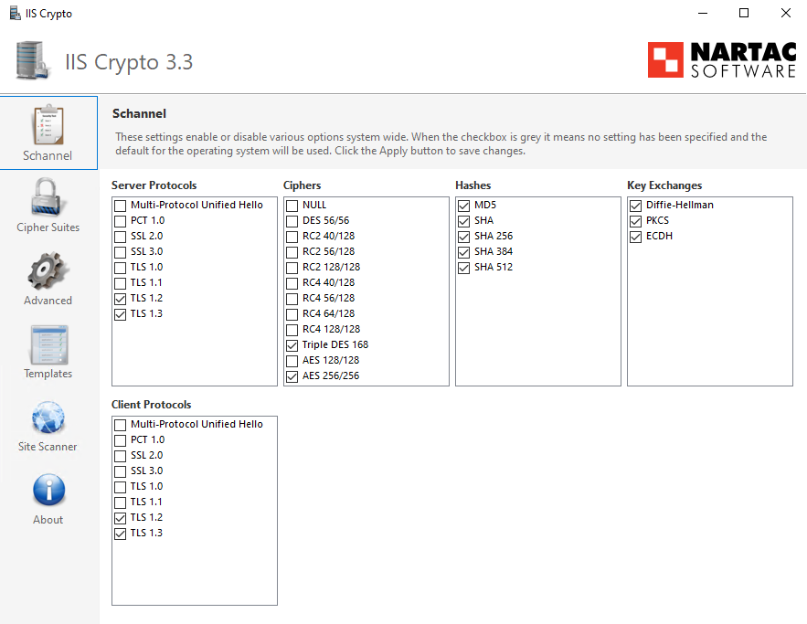

*Custom Installer Manager - New Package*

4.Select the application version, enter a name for your package and click on ***Create***. You can either create a new configuration or use an existing Remote Desktop Manager Installer (\*.rdi) file. For more information, please consult our [Installer File Generator](https://help.remotedesktopmanager.com/installation_installerfilegeneration.html) topic.

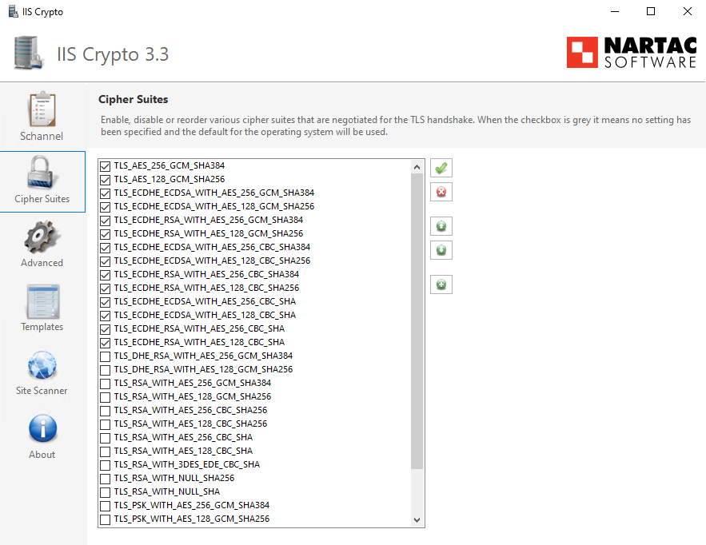

*Installation Package Creation*

When choosing to create a new configuration, select what to include in the custom installer, then click on ***Generate***.

*Installer File Generator*

5.Once the installation package has been created, the request is submitted to our online service. A confirmation dialog window appears if successful.

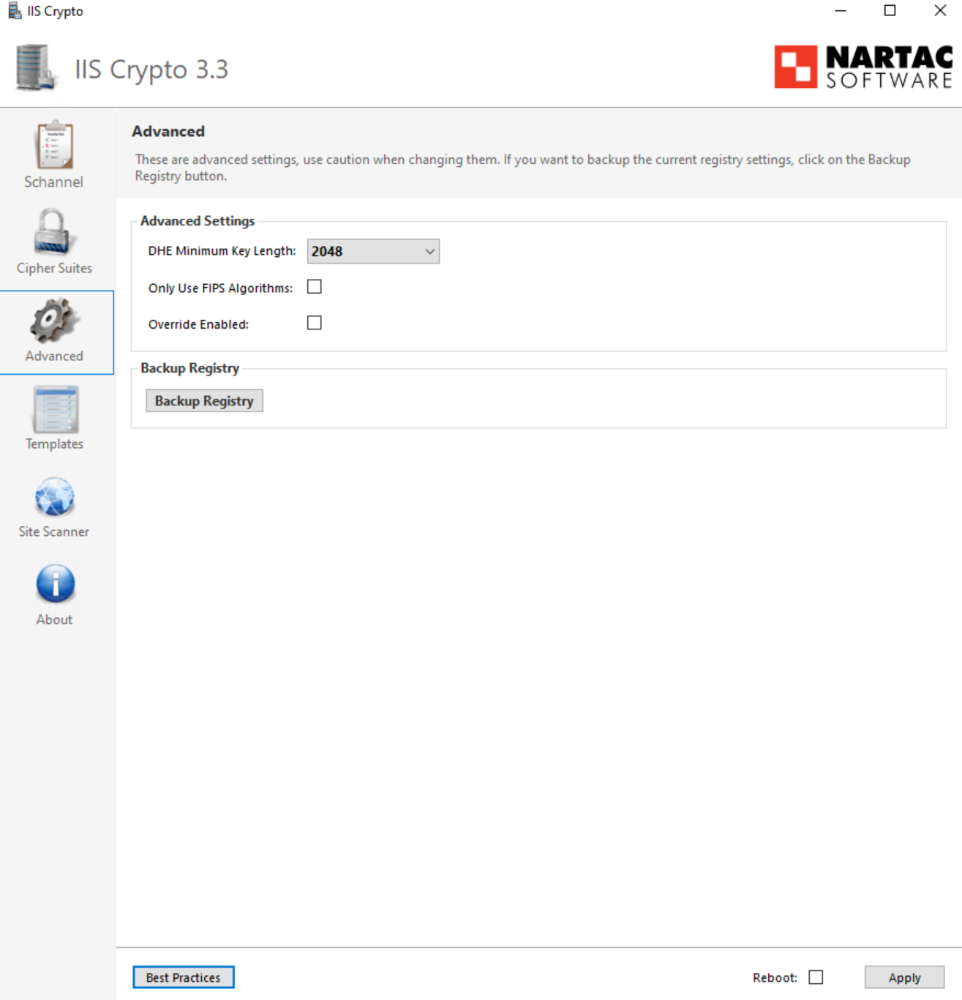

*New package successfully created*

6.The ***Custom Installer Manager*** will display an hourglass 

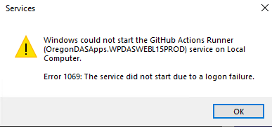

 icon indicating that the package is being processed. When the package has been successfully generated, the ***Custom Installer Manager*** will display a green check mark 

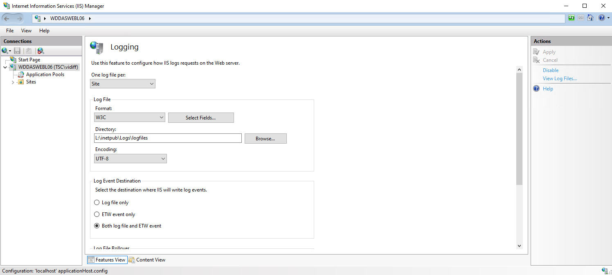

. Note that this process can take a while.

**DOWNLOADING AN INSTALLATION PACKAGE**

Upon completion you will receive a confirmation email.

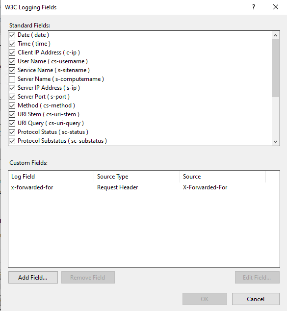

*Email Confirmation - Custom Installer Processed*

From here, there are two ways of downloading the package. You can download it directly from the ***Custom Installer Manager***, or you can log in to the ***Devolutions Account*** you created the installer with.

**DOWNLOAD WITH THE CUSTOM INSTALLER MANAGER**

From the ***Custom Installer Manager***, click on ***Download MSI***.

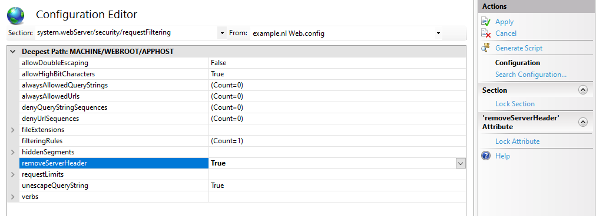

*Custom Installer Manager - Download Package*

**DOWNLOAD FROM THE DEVOLUTIONS CUSTOMER PORTAL**

From the ***Devolutions Customer Portal*** you created the custom installer with, navigate to the ***Custom Installer*** section. Click on ***.msi*** to download the custom installer on your computer.

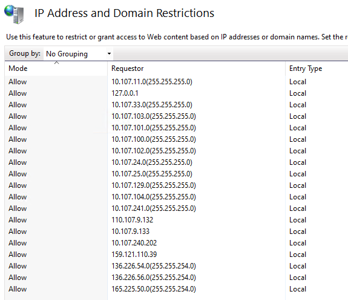

*Devolutions Customer Portal - Download Custom Installer Package*

 

*From \<<https://help.remotedesktopmanager.com/installation_custominstallermanager.html>\>*
